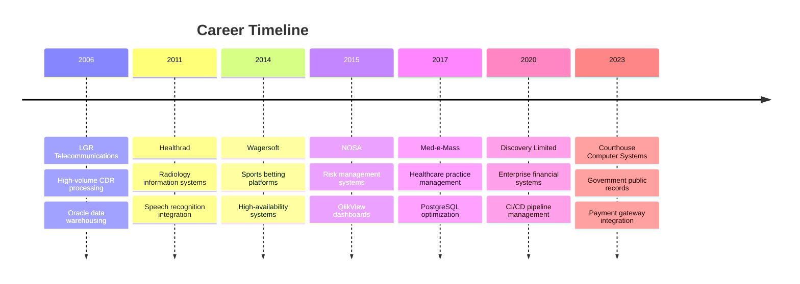

# Hi there! 👋 I'm Christo Lotriet

  
  
  

---

## 🚀 About Me

> **Senior Software Developer** with **15+ years** of experience building robust, scalable applications for government, healthcare, and financial services.

- 🏛️ **Currently**: Web Developer at **Courthouse Computer Systems** (NC, USA)
- 🌍 **Based in**: North Carolina, USA (relocated from South Africa in 2023)
- 💼 **Specializing in**: Government tech, payment systems, database optimization
- 🎯 **Focus**: ASP.NET MVC, C#, MySQL performance tuning
- 🗣️ **Languages**: English & Afrikaans

---

## 💻 Tech Stack & Expertise

### 🔧 Languages & Frameworks

  
  
  
  
  
  

### 🗄️ Databases & Data

  
  
  
  

### 🛠️ Tools & DevOps

  
  
  
  

---

## 📊 GitHub Analytics

  
  

  

---

## 🏆 Professional Journey

---

## 🎯 Current Focus & Achievements

### 🏛️ **Government Technology**
- 📋 **Public Records Management**: Building ASP.NET MVC systems for NC counties
- 💳 **Payment Integration**: Secure tax payment processing for Sheriff departments
- 🔒 **Security & Compliance**: Implementing audit trails and data validation

### ⚡ **Performance Optimization**
- 🗄️ **MySQL Tuning**: Optimizing queries and stored procedures for county-scale data
- 📈 **95% Performance Improvement**: Achieved through advanced threading and database optimization
- 👥 **Team Mentoring**: Supporting colleagues with database and backend architecture

### 🌟 **Recent Projects**
- ✅ Payment gateway integration with real estate & tangible property tax systems
- ✅ Reporting & reconciliation systems eliminating manual spreadsheet processes
- ✅ Accessibility improvements and mobile responsiveness enhancements

---

## 📈 Activity & Contributions

<!--START_SECTION:activity-->
<!--END_SECTION:activity-->

  

---

## 🌟 Featured Repository

  

---

## 📫 Let's Connect!

  
  
  
  
  

---

## 💡 Fun Facts & Interests

- 🌍 **Journey**: Moved from South Africa to North Carolina in 2023
- 🎯 **Passion**: Database performance optimization and clean code architecture
- 🔍 **Always Learning**: Exploring new technologies and development methodologies
- 🏗️ **Problem Solver**: Thrive in environments with sparse specifications
- 📚 **Reverse Engineering**: Love diving into legacy code to understand business rules

---

  
  ### 💻 "Code is poetry written in logic" 💻
  
  
  
  
  **⭐ Star my repositories if you find them helpful!**
  

